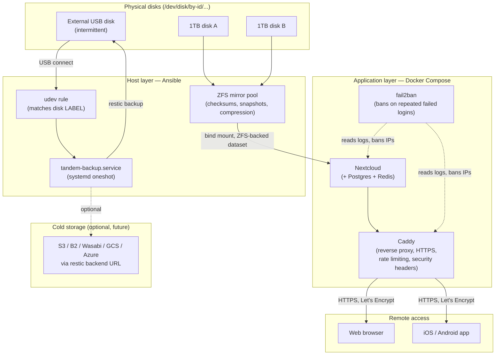

# Architecture

Tandem NAS is split into two layers, deployed by two different tools:

- **Host layer** (Ansible, `ansible/`): disks, ZFS pool, udev rules, systemd
  units, GNOME power settings, firewall. Anything that needs root and talks
  directly to the kernel/hardware.
- **Application layer** (Docker Compose, `docker-compose.yml`): Nextcloud,
  its database/cache, the Caddy reverse proxy, and fail2ban. Anything that's
  just a process that can be replaced by pulling a new image.

This split means the host layer is idempotent and rarely re-run, while the
application layer can be updated/restarted independently without touching
disks or systemd.

## Data flow

## Storage: why ZFS mirror

- **Checksums + self-healing**: every block is checksummed; a mirror lets ZFS
  detect *and repair* silent corruption ("bit rot") from the healthy copy —
  something plain mdadm+ext4 cannot do (mdadm mirrors blocks, but has no way
  to tell which copy is corrupt without a checksum).
- **Cheap snapshots**: copy-on-write snapshots take seconds and cost only the
  blocks that later change — used here for point-in-time protection
  independent of the restic backup.
- **Native quotas**: `zfs set quota=` on a dataset is a hard, kernel-enforced
  cap. (In this project, per-*user* quotas are actually enforced by Nextcloud
  itself — see the trade-off below — but the ZFS-level quota/reservation is
  still available at the dataset level.)

`mdadm` + ext4/xfs remains a reasonable choice if you don't want ZFS's
memory/CPU overhead or licensing considerations (CDDL vs. GPL, resolved in
practice by the out-of-tree `zfsutils-linux` package used here) — the
`zfs-mirror` Ansible role is intentionally the only role that owns disk
formatting, so swapping it for an `mdadm-mirror` role is a contained change.

## Multi-tenancy: Nextcloud quotas, not per-user ZFS datasets

The obvious "ZFS-native" design is one dataset per user with its own quota.
This project deliberately does *not* do that:

- A dataset per user means a bind mount per user into the Nextcloud
  container — every new user requires changing `docker-compose.yml` and
  restarting the stack.
- Nextcloud already enforces a hard per-user quota
  (`occ user:setting <user> files quota <value>`) dynamically, with no
  restart, fully scriptable (`scripts/provision-user.sh`).
- The redundancy/checksum/snapshot benefits of ZFS still apply — Nextcloud's
  entire data directory lives on one ZFS-backed dataset
  (`tandem/nextcloud`).

If you need hard filesystem-level isolation between users (e.g. for quota
enforcement outside of Nextcloud's control, or direct filesystem access per
user), see `docs/zfs-per-user-quota-advanced.md` for the alternative pattern.

## Backup: restic, local-repo trigger, cloud-ready

- `restic` was chosen over BorgBackup specifically because it supports many
  storage backends (local, SFTP, S3, B2, GCS, Azure, Swift, ...) through one
  repository URL — the "cold storage" hook in `.env.example`
  (`RESTIC_REPOSITORY_COLD`) is just a second restic repository, no custom
  abstraction needed.
- The trigger is udev + systemd, not cron: `scripts/prepare-backup-disk.sh`
  labels the external disk once; the udev rule in
  `ansible/roles/udev-backup-trigger` matches *that label specifically*, so
  connecting an unrelated USB drive never fires a backup.
- No restic REST server container is deployed. For a single-host setup, an
  extra always-on network service to reach a repository that's just a local
  path is unnecessary exposed surface. If you later want multiple hosts
  backing up to one restic repository, add a REST server then.

## Remote access: public HTTPS, not VPN

Per the project's requirements, Nextcloud is reachable directly from the
public internet through Caddy (automatic Let's Encrypt), not hidden behind a
VPN — because the requirement is "official iOS/Android app + browser, from
anywhere, without VPN." That surface gets defense in depth by default:

- Caddy: automatic HTTPS, HSTS + security headers, and rate limiting
  (`caddy-ratelimit` module, custom-built image) tightly on
  `/login` and DAV endpoints.
- fail2ban: bans IPs after repeated failed Nextcloud logins and (separately)
  repeated failed SSH attempts — monitoring only, it does not modify
  `sshd_config`.
- Nextcloud: 2FA enforced by default (see `docs/remote-access.md`) and its
  own built-in brute-force throttling.

SSH administration is treated as a **separate, more conservative** surface —
see `docs/remote-access.md` for why the SSH-hardening Ansible role is
opt-in rather than applied automatically.
